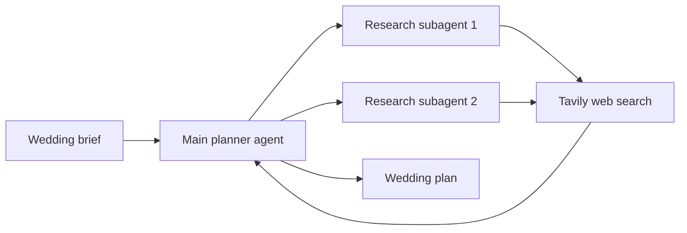

# AI Wedding Planner

A research-assisted wedding planning workspace built with Streamlit and a LangChain multi-agent workflow. Create a structured brief, research venues and vendors, and generate a tailored plan you can download as Markdown.

## Features

- Capture the couple’s location, date, guest count, budget, style, priorities, and planning constraints.
- Coordinate a main planner agent with two research subagents.
- Use Tavily search to gather current information for recommendations.
- Review the wedding plan and original brief in the app.
- Download the finished plan as a Markdown file.
- Load a sample brief to explore the interface.

## How it works



The agents use the Groq-hosted `openai/gpt-oss-120b` model. The main agent can delegate research to either subagent; both subagents use the shared Tavily search tool before the main agent prepares the final plan.

## Requirements

- Python 3.13 or later
- [uv](https://docs.astral.sh/uv/)
- A [Groq API key](https://console.groq.com/keys)
- A [Tavily API key](https://app.tavily.com/)

## Quick start

1. Clone the repository and enter the project directory:

   ```bash
   git clone https://github.com/prajwal2709/AI-Wedding_Planner.git
   cd AI-Wedding_Planner
   ```

2. Install the project dependencies:

   ```bash
   uv sync
   ```

3. Create a `.env` file in the project root and add your API keys:

   ```dotenv
   GROQ_API_KEY=your_groq_api_key
   TAVILY_API_KEY=your_tavily_api_key
   ```

4. Start the app:

   ```bash
   uv run streamlit run app.py
   ```

5. Open the local URL printed by Streamlit, usually `http://localhost:8501`.

## Using the app

Complete the wedding brief, choose a budget range and planning priorities, and select **Generate wedding plan**. When the run finishes, review the plan, inspect the brief used to create it, or download the result. The sidebar includes a sample brief and runtime key status. Saved runs are kept in the current app session.

## Project structure

```text
.
├── app.py                         # Streamlit interface and planner workflow
├── agents.py                      # Research subagents and delegation tools
├── models.py                      # Shared Groq chat model
├── prompts.py                     # Main planner prompts
├── tools.py                       # Tavily web search tool
├── pyproject.toml                 # Project metadata and dependencies
├── uv.lock                        # Locked dependency versions
└── .streamlit/
    └── config.toml                # Streamlit theme
```

## Configuration and security

The app reads `GROQ_API_KEY` and `TAVILY_API_KEY` from environment variables or the local `.env` file. You can also enter temporary key overrides in the app sidebar. Keep real keys private; `.env`, `.venv`, and `.streamlit/secrets.toml` are excluded from Git.
